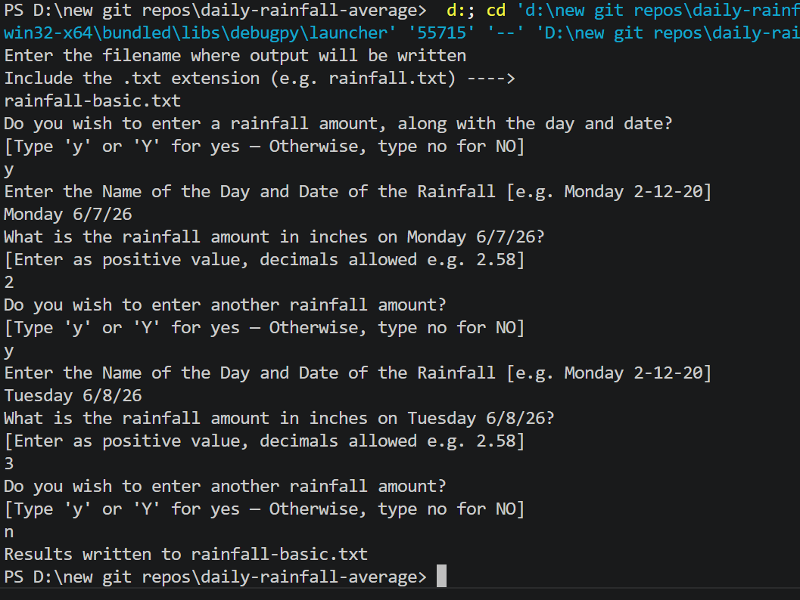
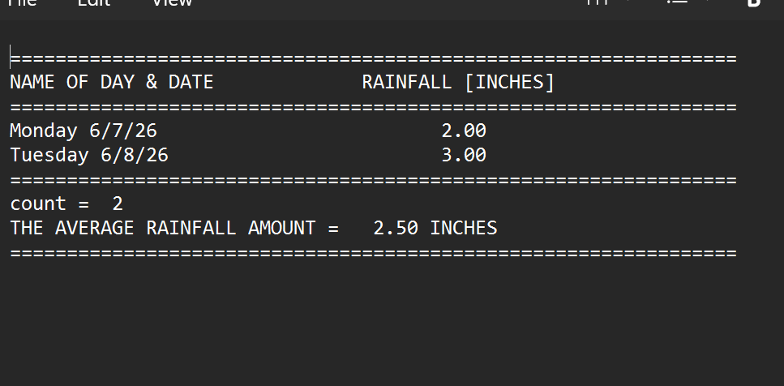
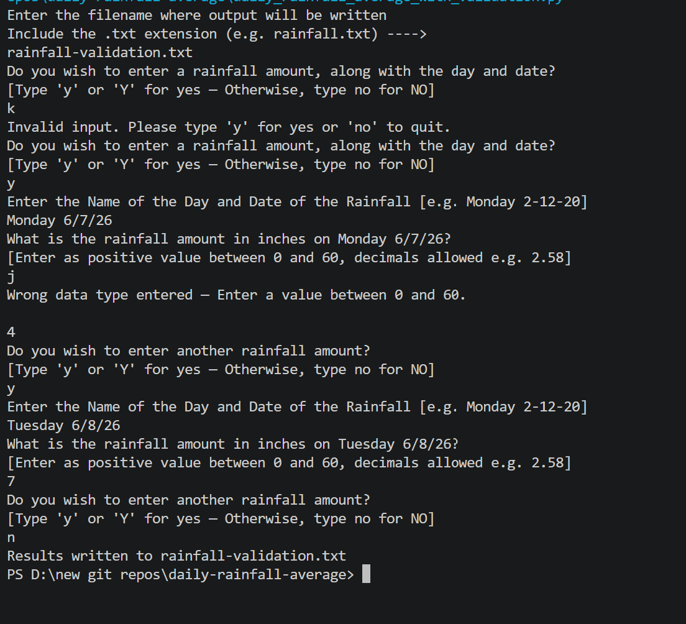
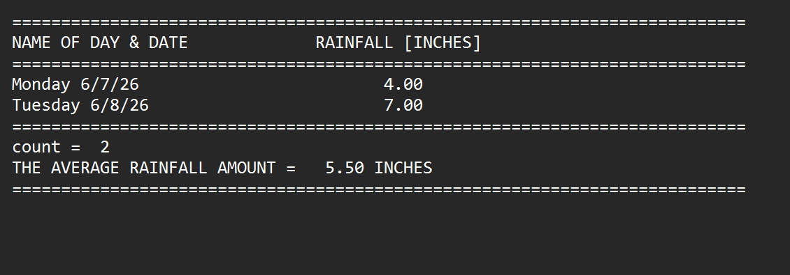

# 🌧️ Daily Rainfall Average Calculator

A Python program that collects daily rainfall amounts using a **WHILE loop**, calculates the average, and writes all results to a user-named external text file. This repo contains **two versions** showing the progression from a basic working program to an improved version with full input validation.

---

## Two Versions — Showing Progression

| File | Description |
|---|---|
| `daily_rainfall_average_basic.py` | Original version — collects rainfall and writes to file, no input validation |
| `daily_rainfall_average_with_validation.py` | Improved version — adds nested validation loop and rejects invalid yes/no input |

---

## Features

- Prompts for a user-defined output file name
- WHILE loop collects day/date and rainfall amount for each entry
- Rejects invalid yes/no responses — only accepts y/yes/n/no
- Calculates total count and average rainfall
- Writes a formatted report to a `.txt` output file
- **Validation version:** rejects non-numeric values, negative numbers, and values over 60 inches

---

## How It Works

1. User enters a name for the output file
2. WHILE loop prompts for day/date and rainfall amount (y/Y to continue)
3. Each entry is written to the output file as it's entered
4. After all entries, average is calculated and written to the file
5. File is closed and user is notified

---

## Example Output File

```
===========================================================================
NAME OF DAY & DATE             RAINFALL [INCHES]
===========================================================================
Monday 3-10-20                   2.50
Tuesday 3-11-20                  0.75
Wednesday 3-12-20                3.10
===========================================================================
count =  3
THE AVERAGE RAINFALL AMOUNT =   2.12 INCHES
===========================================================================
```

---

## Screenshots

### Basic Version



### Validation Version


---

## Technologies Used

- Python 3
- Sentinel-controlled `while` loop
- `get_yes_no()` helper function for validated y/n input
- File I/O — `open()`, `write()`, `close()`
- Nested `while True / try/except` — input validation
- `format()` — aligned column output
- Accumulator pattern

---

## Learning Outcomes

- Writing output to an external text file
- WHILE loop with sentinel control
- Accumulator pattern for running totals
- Nested validation loops
- Average calculation from accumulated data
- Iterating and improving on existing code

---

## How to Run

1. Make sure Python 3 is installed: https://www.python.org/downloads/
2. Clone or download this repo
3. Open a terminal in the repo folder
4. Run basic version: `python daily_rainfall_average_basic.py`
5. Run improved version: `python daily_rainfall_average_with_validation.py`
6. Enter a filename when prompted — a `.txt` report will be created in the same folder

---

## Folder Structure

```
daily-rainfall-average/
├── daily_rainfall_average_basic.py
├── daily_rainfall_average_with_validation.py
├── output_basic.png
├── output_basic_text.png
├── output_validation.png
├── output_validation_text.png
├── rainfall-basic.txt
├── rainfall-validation.txt
├── README.md
├── LICENSE
└── .gitignore
```

---

## License

This project is licensed under the MIT License — see the [LICENSE](LICENSE) file for details.

---

*Written by Marlena Fabrick — Computer Programming, Fall 2020*
